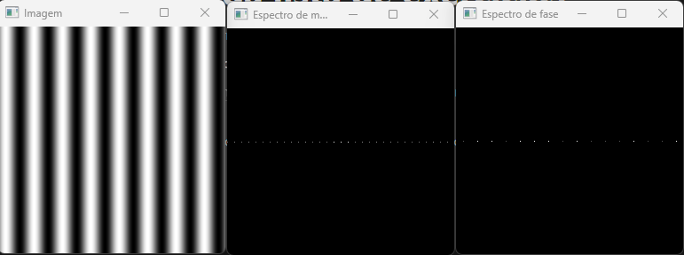
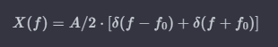
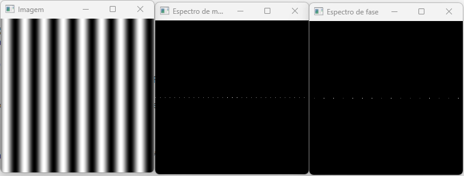
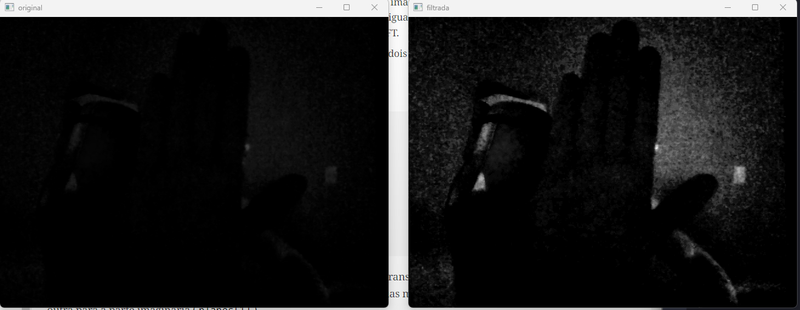
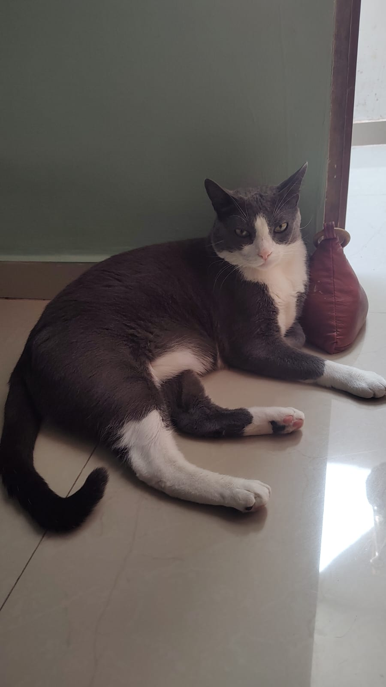
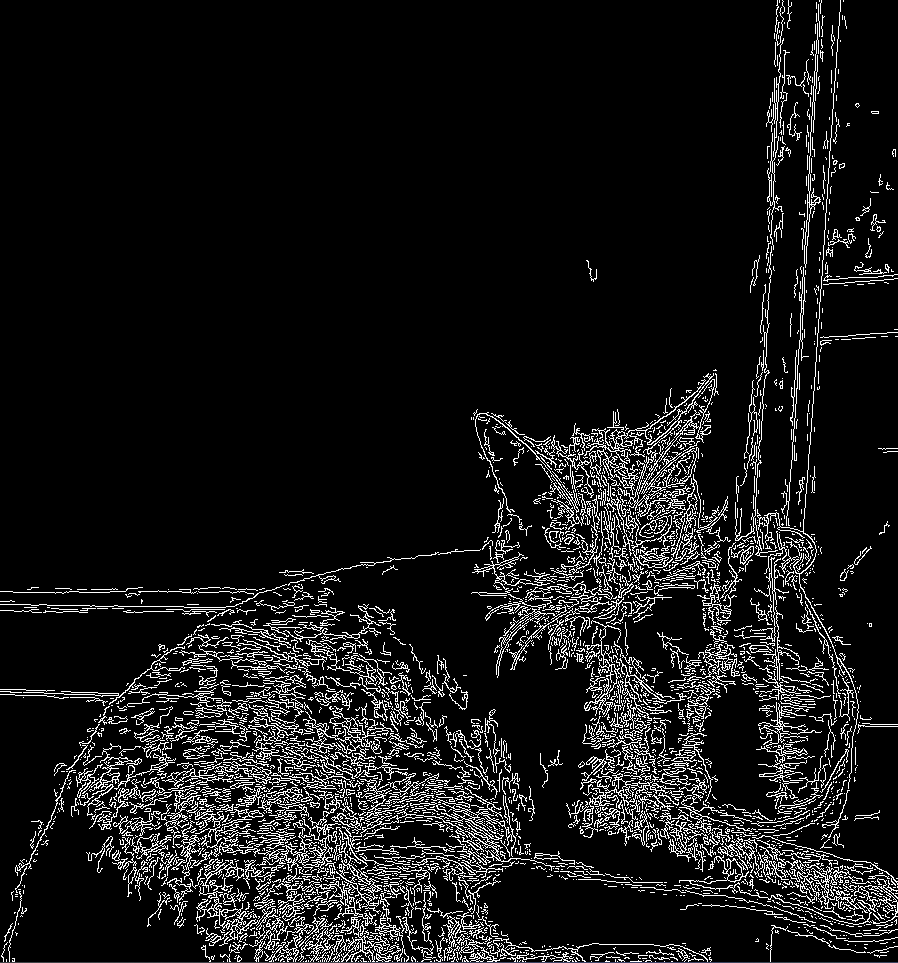

# PDI - Segunda lista de exercicios


### **9. A Tranformada Discreta de Fourier**

- Utilizando os programa [exemplos/dftimage.cpp](https://agostinhobritojr.github.io/tutorial/pdi/exemplos/dftimage.cpp), calcule e apresente o espectro de magnitude da imagem [Figura 7](https://agostinhobritojr.github.io/tutorial/pdi/#fig_senoide256png).

Após aplicar o código dftimage.cpp para imagem da figura 7, obtemos o seguinte spectro de magnitude e espectro de fase.



- Compare o espectro de magnitude gerado para a figura [Figura 7](https://agostinhobritojr.github.io/tutorial/pdi/#fig_senoide256png) com o valor teórico da transformada de Fourier da senóide.

Dado o valor teórico da transformada de fourier da senóide, podemos notar que tem correspondência a uma componente positiva e negativa de frequência comparando a imagem do espectro.



- Usando agora o [filestorage.cpp](https://agostinhobritojr.github.io/tutorial/pdi/exemplos/filestorage.cpp), mostrado na [Listagem 4](https://agostinhobritojr.github.io/tutorial/pdi/#exa_filestorage) como referência, adapte o programa [exemplos/dftimage.cpp](https://agostinhobritojr.github.io/tutorial/pdi/exemplos/dftimage.cpp) para ler a imagem em ponto flutuante armazenada no arquivo YAML equivalente (ilustrado na [Listagem 5](https://agostinhobritojr.github.io/tutorial/pdi/#ex-senoideyml)).

Adaptando o programa dftimage com fiestorage, cheguei ao seguinte código abaixo.

```cpp
#include <iostream>
#include <vector>
#include <opencv2/opencv.hpp>
#include <sstream>
#include <string>

# define M_PI           3.14159265358979323846

int SIDE = 256;
int PERIODOS = 8;

void swapQuadrants(cv::Mat& image) {
  cv::Mat tmp, A, B, C, D;

  // se a imagem tiver tamanho impar, recorta a regiao para o maior
  // tamanho par possivel (-2 = 1111...1110)
  image = image(cv::Rect(0, 0, image.cols & -2, image.rows & -2));

  int centerX = image.cols / 2;
  int centerY = image.rows / 2;

  // rearranja os quadrantes da transformada de Fourier de forma que 
  // a origem fique no centro da imagem
  // A B   ->  D C
  // C D       B A
  A = image(cv::Rect(0, 0, centerX, centerY));
  B = image(cv::Rect(centerX, 0, centerX, centerY));
  C = image(cv::Rect(0, centerY, centerX, centerY));
  D = image(cv::Rect(centerX, centerY, centerX, centerY));

  // swap quadrants (Top-Left with Bottom-Right)
  A.copyTo(tmp);
  D.copyTo(A);
  tmp.copyTo(D);

  // swap quadrant (Top-Right with Bottom-Left)
  C.copyTo(tmp);
  B.copyTo(C);
  tmp.copyTo(B);
}

int main(int argc, char** argv) {
  cv::Mat image, padded, complexImage;
  std::vector<cv::Mat> planos; 
  std::stringstream ss_img, ss_yml;

  ss_yml << "senoide-" << SIDE << ".yml";
  image = cv::Mat::zeros(SIDE, SIDE, CV_32FC1);

  cv::FileStorage fs(ss_yml.str(), cv::FileStorage::WRITE);

  for (int i = 0; i < SIDE; i++) {
    for (int j = 0; j < SIDE; j++) {
      image.at<float>(i, j) = 127 * sin(2 * M_PI * PERIODOS * j / SIDE) + 128;
    }
  }

  fs << "mat" << image;
  fs.release();

  cv::normalize(image, image, 0, 255, cv::NORM_MINMAX);
  image.convertTo(image, CV_8U);
  ss_img << "senoide-" << SIDE << ".png";
  cv::imwrite(ss_img.str(), image);

  fs.open(ss_yml.str(), cv::FileStorage::READ);
  fs["mat"] >> image;

  cv::normalize(image, image, 0, 255, cv::NORM_MINMAX);
  image.convertTo(image, CV_8U);
  
  if (image.empty()) {
    std::cout << "Erro abrindo imagem" << argv[1] << std::endl;
    return EXIT_FAILURE;
  }

  // expande a imagem de entrada para o melhor tamanho no qual a DFT pode ser
  // executada, preenchendo com zeros a lateral inferior direita.
  int dft_M = cv::getOptimalDFTSize(image.rows);
  int dft_N = cv::getOptimalDFTSize(image.cols); 
  cv::copyMakeBorder(image, padded, 0, dft_M - image.rows, 0, dft_N - image.cols, cv::BORDER_CONSTANT, cv::Scalar::all(0));

  // prepara a matriz complexa para ser preenchida
  // primeiro a parte real, contendo a imagem de entrada
  planos.push_back(cv::Mat_<float>(padded)); 
  // depois a parte imaginaria com valores nulos
  planos.push_back(cv::Mat::zeros(padded.size(), CV_32F));

  // combina os planos em uma unica estrutura de dados complexa
  cv::merge(planos, complexImage);  

  // calcula a DFT
  cv::dft(complexImage, complexImage); 
  swapQuadrants(complexImage);

  // planos[0] : Re(DFT(image)
  // planos[1] : Im(DFT(image)
  cv::split(complexImage, planos);

  // calcula o espectro de magnitude e de fase (em radianos)
  cv::Mat magn, fase;
  cv::cartToPolar(planos[0], planos[1], magn, fase, false);
  cv::normalize(fase, fase, 0, 1, cv::NORM_MINMAX);

  // caso deseje apenas o espectro de magnitude da DFT, use:
  cv::magnitude(planos[0], planos[1], magn); 

  // some uma constante para evitar log(0)
  // log(1 + sqrt(Re(DFT(image))^2 + Im(DFT(image))^2))
  magn += cv::Scalar::all(1);

  // calcula o logaritmo da magnitude para exibir
  // com compressao de faixa dinamica
  log(magn, magn);
  cv::normalize(magn, magn, 0, 1, cv::NORM_MINMAX);

  // exibe as imagens processadas
  cv::imshow("Imagem", image);  
  cv::imshow("Espectro de magnitude", magn);
  cv::imshow("Espectro de fase", fase);

  cv::waitKey();
  return EXIT_SUCCESS;
}
```

Após executar o código, obtive a seguinte resposta de image, espectro de magnitude e de fase.



- Compare o novo espectro de magnitude gerado com o valor teórico da transformada de Fourier da senóide. O que mudou para que o espectro de magnitude gerado agora esteja mais próximo do valor teórico? Porque isso aconteceu?

O que mudou foi a utilização em ponto fluante, sem perda nos arredondamentos que comprometiam o cálculo da transformada de Fourier.

### 10.  **Filtragem no Domínio da Frequência**

Utilizando o programa [exemplos/dftfilter.cpp](https://agostinhobritojr.github.io/tutorial/pdi/exemplos/dftfilter.cpp) como referência, implemente o filtro homomórfico para melhorar imagens com iluminação irregular. Crie uma cena mal iluminada e ajuste os parâmetros do filtro homomórfico para corrigir a iluminação da melhor forma possível. Assuma que a imagem fornecida é em tons de cinza.

Aplicando o código abaixo com filtro homomórfico para melhorar images com iluminação irregular. Apliquei um loop para modificar os parametros de filtragem após clicar em algumas teclas selecionadas. 

```cpp
#include <iostream>
#include <opencv2/opencv.hpp>
#include <opencv2/imgproc/imgproc.hpp>

#define RADIUS 20

using namespace cv;
using namespace std;

// troca os quadrantes da imagem da DFT
void deslocaDFT(Mat& image ){
  Mat tmp, A, B, C, D;

  // se a imagem tiver tamanho impar, recorta a regiao para
  // evitar cópias de tamanho desigual
  image = image(Rect(0, 0, image.cols & -2, image.rows & -2));
  int cx = image.cols/2;
  int cy = image.rows/2;

  // reorganiza os quadrantes da transformada
  // A B   ->  D C
  // C D       B A
  A = image(Rect(0, 0, cx, cy));
  B = image(Rect(cx, 0, cx, cy));
  C = image(Rect(0, cy, cx, cy));
  D = image(Rect(cx, cy, cx, cy));

  // A <-> D
  A.copyTo(tmp);  D.copyTo(A);  tmp.copyTo(D);

  // C <-> B
  C.copyTo(tmp);  B.copyTo(C);  tmp.copyTo(B);
}

int main(int , char**){
  VideoCapture cap;
  Mat imaginaryInput, complexImage, multsp;
  Mat padded, filter, mag;
  Mat image, imagegray, tmp;
  Mat_<float> realInput, zeros;
  vector<Mat> planos;
  
  float Gh = 1.0, Gl = 1.0, d = 1.0, c = 1.0;
  double radius;

  // guarda tecla capturada
  char key;

  // valores ideais dos tamanhos da imagem
  // para calculo da DFT
  int dft_M, dft_N;

  // abre a câmera default
  cap.open(0);
  if(!cap.isOpened())
    return -1;

  // captura uma imagem para recuperar as
  // informacoes de gravação
  cap >> image;

  // identifica os tamanhos otimos para
  // calculo do FFT
  dft_M = getOptimalDFTSize(image.rows);
  dft_N = getOptimalDFTSize(image.cols);

  // realiza o padding da imagem
  copyMakeBorder(image, padded, 0,
                 dft_M - image.rows, 0,
                 dft_N - image.cols,
                 BORDER_CONSTANT, Scalar::all(0));

  // parte imaginaria da matriz complexa (preenchida com zeros)
  zeros = Mat_<float>::zeros(padded.size());

  // prepara a matriz complexa para ser preenchida
  complexImage = Mat(padded.size(), CV_32FC2, Scalar(0));

  // a função de transferência (filtro frequencial) deve ter o
  // mesmo tamanho e tipo da matriz complexa
  filter = complexImage.clone();

  // cria uma matriz temporária para criar as componentes real
  // e imaginaria do filtro ideal
  tmp = Mat(dft_M, dft_N, CV_32F);

  // prepara o filtro homomorfico
  for(int i=0; i<dft_M; i++)
  {
    for(int j=0; j<dft_N; j++)
    {
      radius = (double) (i - dft_M / 2) * (i - dft_M / 2) + (j - dft_N / 2) * (j - dft_N / 2);
      tmp.at<float> (i, j) = (Gh - Gl) * (1 - exp(-c * (radius / pow(d, 2)))) + Gl;
    }
  }

  // cria a matriz com as componentes do filtro e junta
  // ambas em uma matriz multicanal complexa
  Mat comps[]= {tmp, tmp};
  merge(comps, 2, filter);

  for(;;){
    cap >> image;
    cvtColor(image, imagegray, cv::COLOR_BGR2GRAY);//CV_BGR2GRAY
    imshow("original", imagegray);

    // realiza o padding da imagem
    copyMakeBorder(imagegray, padded, 0,
                   dft_M - image.rows, 0,
                   dft_N - image.cols,
                   BORDER_CONSTANT, Scalar::all(0));

    // limpa o array de matrizes que vao compor a
    // imagem complexa
    planos.clear();
    // cria a compoente real
    realInput = Mat_<float>(padded);
    // insere as duas componentes no array de matrizes
    planos.push_back(realInput);
    planos.push_back(zeros);

    // combina o array de matrizes em uma unica
    // componente complexa
    merge(planos, complexImage);

    // calcula o dft
    dft(complexImage, complexImage);

    // realiza a troca de quadrantes
    deslocaDFT(complexImage);

    // aplica o filtro frequencial
    mulSpectrums(complexImage,filter,complexImage,0);

    // limpa o array de planos
    planos.clear();

    // troca novamente os quadrantes
    deslocaDFT(complexImage);

    cout << "Gl = " << Gl << " Gh = " << Gh << " D0 = " << d << " c = " << c << endl;
    // calcula a DFT inversa
    idft(complexImage, complexImage);

    // limpa o array de planos
    planos.clear();

    // separa as partes real e imaginaria da
    // imagem filtrada
    split(complexImage, planos);

    // normaliza a parte real para exibicao
    normalize(planos[0], planos[0], 0, 1, cv::NORM_MINMAX);//CV_MINMAX
    imshow("filtrada", planos[0]);

    key = (char) waitKey(10);
    if( key == 27 ) break; // esc pressed!
    switch(key){
      // aumenta o componente de iluminância (Gl)
    case 'a':
      Gl = Gl + 1;
      break;
      // diminui o componente de iluminância (Gl)
    case 's':
      Gl = Gl - 1;
      break;
      // aumenta o componente de refletância (Gh)
    case 'd':
      Gh = Gh + 1;
      break;
      // diminui o componente de refletância (Gh)
    case 'f':
      Gh = Gh - 1;
      // aumenta o componente de frequencia de corte (d)
    case 'g':
      d = d + 1;
      break;
      // diminui o componente de frequencia de corte (d)
    case 'h':
      d = d - 1;
      break;
      // aumenta a constante (c)
    case 'j':
      c = c + 1;
      break;
      // diminui a constante (c)
    case 'k':
      c = c - 1;
      break;
    }
  }
  return 0;
}
```

Obtive esse resultado como saída, adicionando os parâmetros melhores para essa filtragem.



### 11. **Detecção de bordas com o algoritmo de Canny**

- Utilizando os programas [exemplos/canny.cpp](https://agostinhobritojr.github.io/tutorial/pdi/exemplos/canny.cpp) e [exemplos/pontilhismo.cpp](https://agostinhobritojr.github.io/tutorial/pdi/exemplos/pontilhismo.cpp) como referência, implemente um programa `cannypoints.cpp`. A idéia é usar as bordas produzidas pelo algoritmo de Canny para melhorar a qualidade da imagem pontilhista gerada. A forma como a informação de borda será usada é livre. Entretanto, são apresentadas algumas sugestões de técnicas que poderiam ser utilizadas:
    - Desenhar pontos grandes na imagem pontilhista básica;
    - Usar a posição dos pixels de borda encontrados pelo algoritmo de Canny para desenhar pontos nos respectivos locais na imagem gerada.
    - Experimente ir aumentando os limiares do algoritmo de Canny e, para cada novo par de limiares, desenhar círculos cada vez menores nas posições encontradas. A [Figura 29](https://agostinhobritojr.github.io/tutorial/pdi/#fig_lenapontilhista) foi desenvolvida usando essa técnica.
- Escolha uma imagem de seu gosto e aplique a técnica que você desenvolveu.
- Descreva no seu relatório detalhes do procedimento usado para criar sua técnica pontilhista.

Primeiramente fiz a aplicação do filtro de canny para detecção de bordas, utilizei a imagem do meu gato como referência. Utilizando o código do exemplo canny.cpp. Obtive esse resultado abaixo:





Utilizando a técnica do pontilhismo para desenhar floki a partir da aplicação do filtro do resultado de canny, obtive esse resultado.


### 11. **Quantização vetorial com k-means**

Utilizando o programa [kmeans.cpp](https://agostinhobritojr.github.io/tutorial/pdi/exemplos/kmeans.cpp) como exemplo prepare um programa exemplo onde a execução do código se dê usando o parâmetro `nRodadas=1` e inciar os centros de forma aleatória usando o parâmetro `KMEANS_RANDOM_CENTERS` ao invés de `KMEANS_PP_CENTERS`. Realize 10 rodadas diferentes do algoritmo e compare as imagens produzidas. Explique porque elas podem diferir tanto.

Utilizando o código desenvolvido abaixo e tomando como referência [kmeans.cpp](https://agostinhobritojr.github.io/tutorial/pdi/exemplos/kmeans.cpp).

```cpp
#include <cstdlib>
#include <opencv2/opencv.hpp>

int main(int argc, char** argv) {
  int nClusters = 8, nRodadas = 1;  // Modificado para nRodadas=1

  cv::Mat rotulos, centros;

  if (argc != 3) {
    std::cout << "kmeans entrada.jpg saida.jpg\n";
    exit(0);
  }

  cv::Mat img = cv::imread("C:/Users/Eduardo Soares/Desktop/Projetos Pessoais/projects-open-cv/images/sushi.jpg", cv::IMREAD_COLOR);
  cv::Mat samples(img.rows * img.cols, 3, CV_32F);

  for (int y = 0; y < img.rows; y++) {
    for (int x = 0; x < img.cols; x++) {
      for (int z = 0; z < 3; z++) {
        samples.at<float>(y + x * img.rows, z) = img.at<cv::Vec3b>(y, x)[z];
      }
    }
  }

  // Modificado para usar KMEANS_RANDOM_CENTERS
  cv::kmeans(samples, nClusters, rotulos,
             cv::TermCriteria(cv::TermCriteria::EPS | cv::TermCriteria::COUNT,
                              10000, 0.0001),
             nRodadas, cv::KMEANS_RANDOM_CENTERS, centros);

  cv::Mat rotulada(img.size(), img.type());
  for (int y = 0; y < img.rows; y++) {
    for (int x = 0; x < img.cols; x++) {
      int indice = rotulos.at<int>(y + x * img.rows, 0);
      rotulada.at<cv::Vec3b>(y, x)[0] = (uchar)centros.at<float>(indice, 0);
      rotulada.at<cv::Vec3b>(y, x)[1] = (uchar)centros.at<float>(indice, 1);
      rotulada.at<cv::Vec3b>(y, x)[2] = (uchar)centros.at<float>(indice, 2);
    }
  }

  cv::imshow("kmeans", rotulada);
  cv::waitKey(0);
  cv::imwrite("saida.jpg", rotulada);

  return 0;
}
```

A razão pela qual as imagens podem diferir tanto em diferentes execuções do algoritmo k-means é que o processo de inicialização dos centros de cluster é aleatório quando você usa **`KMEANS_RANDOM_CENTERS`**. Isso significa que, em cada execução, os centros iniciais dos clusters podem ser diferentes, levando a diferentes agrupamentos finais.

